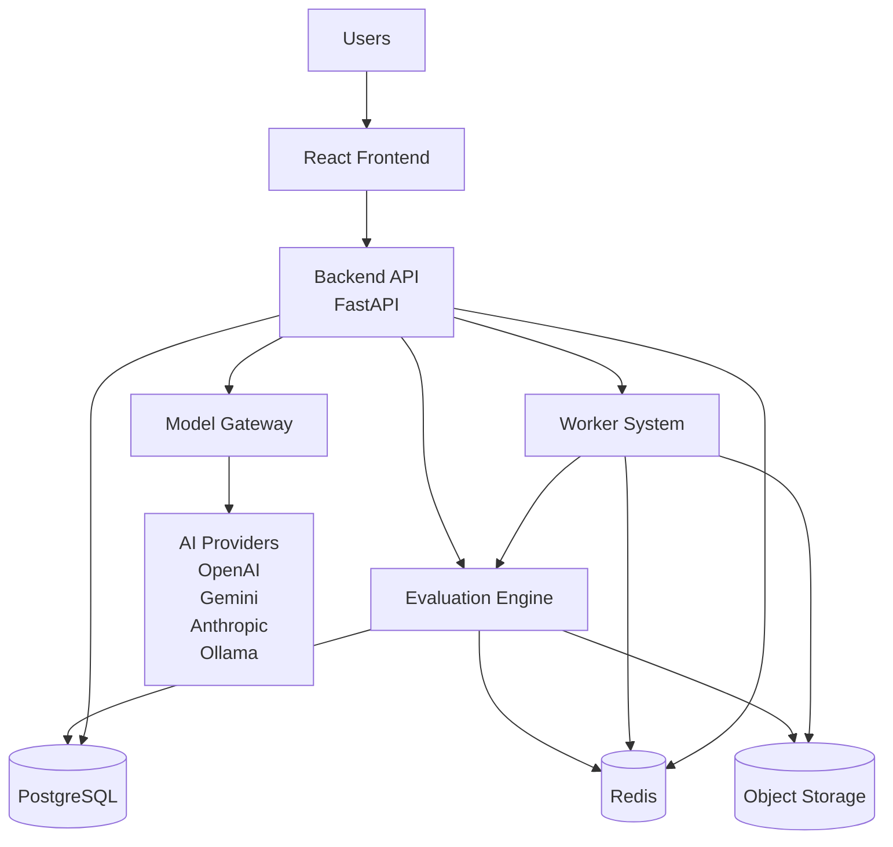
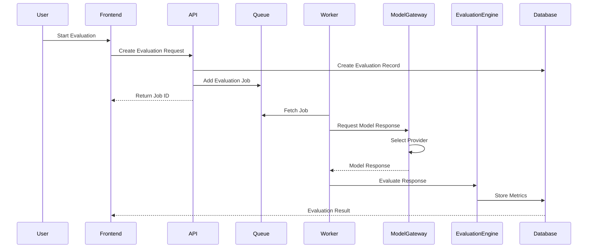
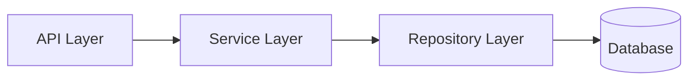
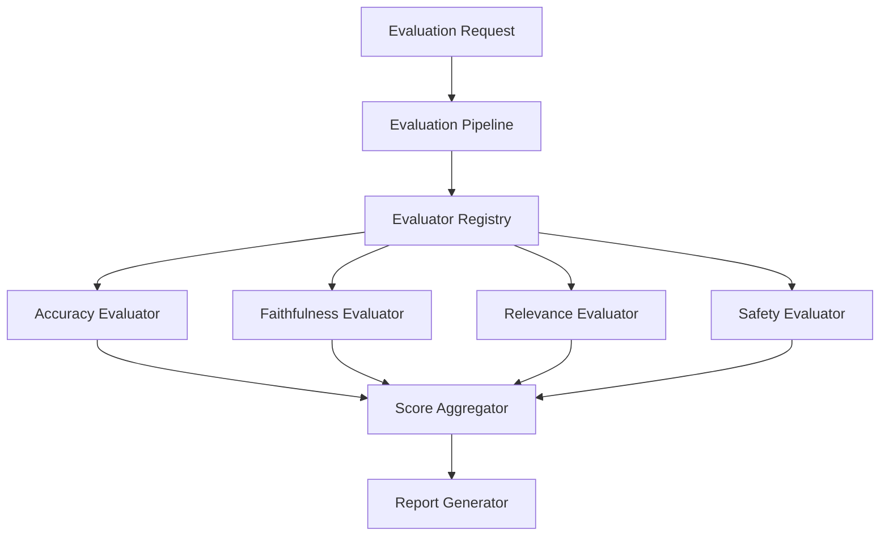
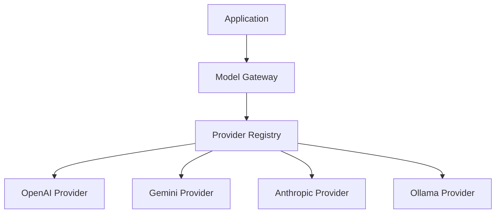
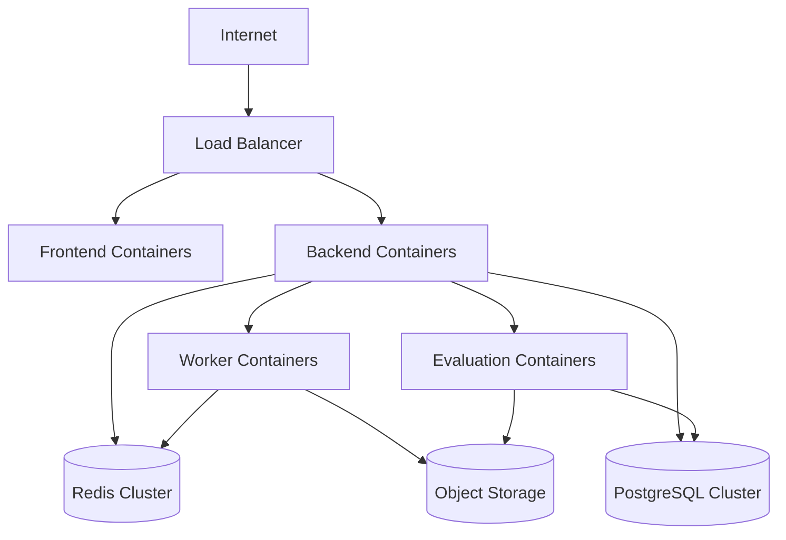
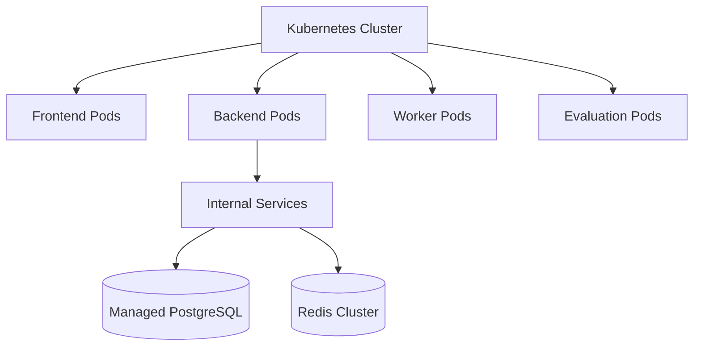

# AI Evaluation Platform

# System Architecture Diagrams

## 1. High Level System Architecture

---

# 2. Evaluation Processing Flow

---

# 3. Backend Internal Architecture

---

# 4. Evaluation Engine Architecture

---

# 5. Model Gateway Architecture

---

# 6. Deployment Architecture

---

# 7. Future Kubernetes Architecture

---

# Diagram Guidelines

All architecture diagrams should:

- Use Mermaid format
- Be version controlled
- Represent actual implementation
- Be updated with major architecture changes

---

# Future Diagrams

Planned additions:

- Database ER diagram
- Authentication flow
- Multi-tenancy architecture
- Evaluation lifecycle
- CI/CD pipeline
- Observability architecture
