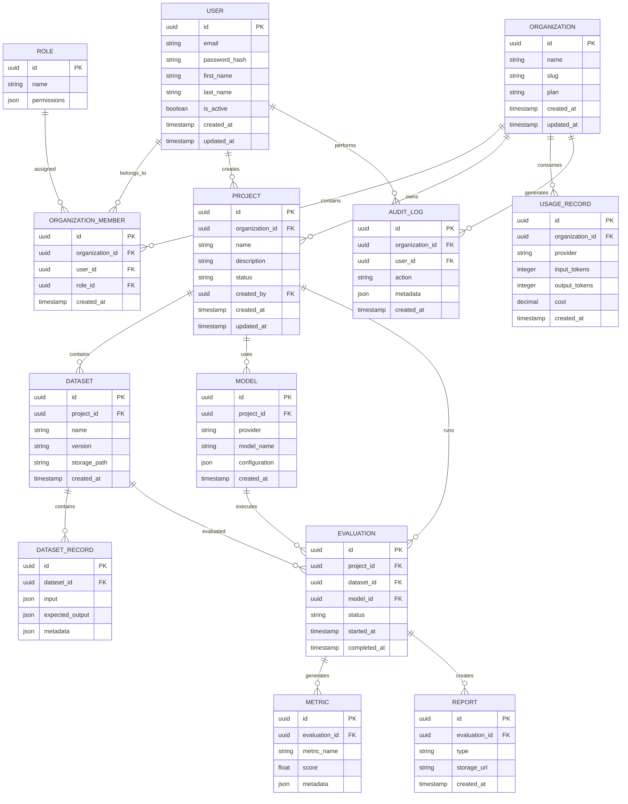

# AI Evaluation Platform

# Database ER Diagram

## 1. Entity Relationship Overview



---

# 2. Relationship Explanation

## User → Organization

A user can belong to multiple organizations.

Example:

```
User A

 |

Organization 1

Organization 2
```

---

## Organization → Projects

An organization owns multiple AI projects.

Example:

```
Company

 |

Customer Support Bot

Medical Assistant

Document AI
```

---

## Project → Dataset

Each project can contain multiple datasets.

Examples:

```
Project

 |

Dataset v1

Dataset v2

Dataset v3
```

---

## Project → Models

A project can evaluate multiple AI models.

Example:

```
Customer Bot Project

 |

GPT Model

Claude Model

Llama Model
```

---

## Evaluation Lifecycle

Relationship:

```
Dataset

   +

Model

   |

Evaluation

   |

Metrics

   |

Report
```

Example:

```
Dataset:
Customer Questions


Model:
GPT


Evaluation:
GPT Accuracy Test


Metrics:
Accuracy = 92%

Report:
PDF
```

---

# 3. Future Database Extensions

## Billing Module

Future tables:

```
Subscription

Invoice

Payment

UsageLimit
```

---

## Enterprise Security

Future tables:

```
SSOConfiguration

SecurityPolicy

ComplianceReport
```

---

## Advanced Evaluation

Future tables:

```
PromptTemplate

Experiment

ExperimentVersion

HumanFeedback
```

---

# 4. Design Notes

## UUID Primary Keys

All entities use UUIDs.

Benefits:

- Distributed systems support
- Better security
- Easier migration

---

## JSONB Usage

JSONB is used for flexible AI metadata.

Examples:

- Model parameters
- Evaluation configuration
- Custom metrics

---

## Soft Delete Strategy

Future support:

```
deleted_at TIMESTAMP
```

Allows:

- Data recovery
- Compliance requirements

---

# Summary

The ER model supports:

- Multi-tenant SaaS architecture
- AI model evaluation workflows
- Dataset versioning
- Metrics tracking
- Enterprise auditing

The schema is designed for future scale and commercial deployment.
